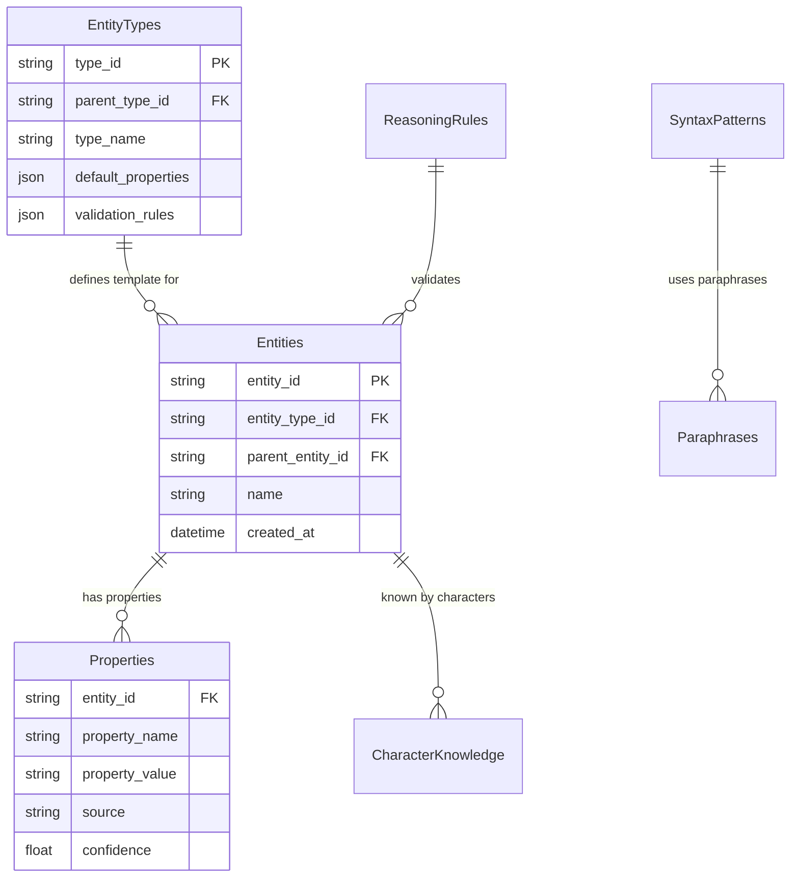

# Entity-Property システム用CSVデータ構造設計

## データ構造概要

memo.txtの階層的プロパティ継承システムを実現するCSV構造を定義します。

---

## 1. Entities.csv - Entity定義

**目的**: 具体的なEntityインスタンスの定義

| 列名 | 型 | 説明 | 例 |
|------|----|----|-----|
| entity_id | string | 一意のEntity識別子 | "mac_burger_001" |
| entity_type_id | string | EntityTypeへの参照 | "mac_burger" |
| parent_entity_id | string | 継承元Entity ID (nullable) | "food_portable" |
| name | string | 表示名 | "誰々が食べていたマックのチーズバーガー" |
| description | string | 詳細説明 | "半分ほど食べられた状態" |
| created_at | datetime | 作成日時 | "2024-01-15T10:30:00" |
| is_active | bool | アクティブ状態 | true |

**サンプルデータ**:
```csv
entity_id,entity_type_id,parent_entity_id,name,description,created_at,is_active
food_portable,food_base,,携帯食料,持ち運び可能な食料の基本型,2024-01-15T10:00:00,true
mac_burger,food_portable,,マックのチーズバーガー,マクドナルドのチーズバーガー,2024-01-15T10:15:00,true
mac_burger_001,mac_burger,,誰々が食べていたマックのチーズバーガー,半分ほど食べられた状態,2024-01-15T10:30:00,true
```

---

## 2. EntityTypes.csv - Entity型定義

**目的**: Entity型のテンプレート定義

| 列名 | 型 | 説明 | 例 |
|------|----|----|-----|
| type_id | string | 型識別子 | "mac_burger" |
| parent_type_id | string | 継承元型ID (nullable) | "food_portable" |
| type_name | string | 型名 | "マックのチーズバーガー" |
| description | string | 型説明 | "マクドナルドのチーズバーガー型" |
| default_properties | json | デフォルトプロパティ | {"size": 0.3, "brand": "McDonald's"} |
| validation_rules | json | 検証ルール | {"weight": {"min": 0.05, "max": 0.5}} |
| description_patterns | json | 描写パターン | ["[BRAND]の[TYPE]", "[SIZE]サイズの[TYPE]"] |

**サンプルデータ**:
```csv
type_id,parent_type_id,type_name,description,default_properties,validation_rules,description_patterns
food_base,,食料基本型,すべての食料の基本型,"{""edible"": true, ""nutritional_value"": ""medium""}","{""weight"": {""min"": 0.01}}","[""食べ物"", ""[TYPE]""]"
food_portable,food_base,携帯食料,持ち運び可能な食料,"{""weight"": 0.1, ""portable"": true}","{""weight"": {""max"": 1.0}}","[""携帯できる[TYPE]"", ""[WEIGHT]kgの[TYPE]""]"
mac_burger,food_portable,マックのチーズバーガー,マクドナルドのチーズバーガー,"{""size"": 0.3, ""brand"": ""McDonald's"", ""type"": ""burger""}","{""size"": {""min"": 0.2, ""max"": 0.4}}","[""[BRAND]の[TYPE]"", ""[SIZE]サイズのハンバーガー""]"
```

---

## 3. Properties.csv - プロパティ値定義

**目的**: 個別Entityのプロパティ値（継承・上書き含む）

| 列名 | 型 | 説明 | 例 |
|------|----|----|-----|
| entity_id | string | Entity識別子 | "mac_burger_001" |
| property_name | string | プロパティ名 | "weight" |
| property_value | string | プロパティ値 | "0.12" |
| property_type | string | データ型 | "float" |
| source | string | 値の由来 | "override" / "inherited" / "default" |
| confidence | float | 信頼度 (0.0-1.0) | 0.95 |
| last_modified | datetime | 最終更新日時 | "2024-01-15T10:30:00" |
| notes | string | 備考 | "食べかけのため軽量化" |

**サンプルデータ**:
```csv
entity_id,property_name,property_value,property_type,source,confidence,last_modified,notes
mac_burger_001,weight,0.12,float,override,0.95,2024-01-15T10:30:00,食べかけのため軽量化
mac_burger_001,size,0.3,float,inherited,1.0,2024-01-15T10:15:00,親型から継承
mac_burger_001,brand,McDonald's,string,inherited,1.0,2024-01-15T10:15:00,親型から継承
mac_burger_001,owner,誰々,string,override,0.9,2024-01-15T10:30:00,所有者情報
mac_burger_001,condition,食べかけ,string,override,1.0,2024-01-15T10:30:00,現在の状態
```

---

## 4. SyntaxPatterns.csv - 構文パターン定義

**目的**: テキスト生成用の構文パターン

| 列名 | 型 | 説明 | 例 |
|------|----|----|-----|
| pattern_id | string | パターン識別子 | "scene_description_basic" |
| category | string | パターンカテゴリ | "scene_description" |
| template | string | 構文テンプレート | "{scene description:[あなたは[LOCATION]に立っている。], {目の前には[OBJECT]がある。}}" |
| required_entities | json | 必須Entity参照 | ["LOCATION", "OBJECT"] |
| conditions | json | 適用条件 | {"LOCATION.type": "indoor", "OBJECT.visible": true} |
| priority | int | 優先度 | 100 |
| usage_count | int | 使用回数 | 0 |
| last_used | datetime | 最終使用日時 | null |

**サンプルデータ**:
```csv
pattern_id,category,template,required_entities,conditions,priority,usage_count,last_used
scene_basic,scene_description,"{scene description:[あなたは[LOCATION]に立っている。], {目の前には[OBJECT]がある。}}","[""LOCATION"", ""OBJECT""]","{""LOCATION.accessible"": true}",100,0,
object_detail,object_description,"[OBJECT]は[OBJECT.condition]の状態で[OBJECT.location]にある。","[""OBJECT""]","{""OBJECT.visible"": true}",80,0,
character_action,"[CHARACTER]は[ACTION]している。","[""CHARACTER"", ""ACTION""]","{""CHARACTER.present"": true}",90,0,
```

---

## 5. Paraphrases.csv - 言い換え辞書

**目的**: 表現の多様性確保

| 列名 | 型 | 説明 | 例 |
|------|----|----|-----|
| key | string | 言い換えキー | "standing_location" |
| category | string | カテゴリ | "position" |
| paraphrase | string | 言い換え表現 | "立っている" |
| conditions | json | 適用条件 | {"formality": "casual"} |
| weight | float | 選択重み | 1.0 |
| usage_count | int | 使用回数 | 0 |
| last_used | datetime | 最終使用日時 | null |

**サンプルデータ**:
```csv
key,category,paraphrase,conditions,weight,usage_count,last_used
standing_location,position,立っている,"{""formality"": ""casual""}",1.0,0,
standing_location,position,佇んでいる,"{""formality"": ""formal""}",0.8,0,
standing_location,position,いる,"{""formality"": ""casual""}",0.9,0,
object_presence,existence,ある,"{""certainty"": ""high""}",1.0,0,
object_presence,existence,存在する,"{""formality"": ""formal""}",0.7,0,
object_presence,existence,置かれている,"{""object.placed"": true}",0.8,0,
```

---

## 6. ReasoningRules.csv - 推論ルール定義

**目的**: 一貫性チェックと推論処理

| 列名 | 型 | 説明 | 例 |
|------|----|----|-----|
| rule_id | string | ルール識別子 | "weight_consistency_check" |
| rule_name | string | ルール名 | "重量一貫性チェック" |
| condition | string | 適用条件 | "entity.type == 'food' AND entity.condition == '食べかけ'" |
| consequence | string | 結果処理 | "entity.weight *= 0.6" |
| priority | float | 優先度 | 0.8 |
| threshold | float | 閾値 | 0.1 |
| description | string | 説明 | "食べかけの食料は重量が減少する" |
| is_active | bool | アクティブ状態 | true |

**サンプルデータ**:
```csv
rule_id,rule_name,condition,consequence,priority,threshold,description,is_active
weight_consistency,重量一貫性チェック,"entity.type == 'food' AND entity.condition == '食べかけ'","entity.weight *= 0.6",0.8,0.1,食べかけの食料は重量が減少する,true
knowledge_check,キャラクター知識チェック,"character.knowledge.contains(entity.id) == false","generate_surprise_event(character, entity)",0.9,0.2,キャラクターが知らない物への反応,true
size_weight_relation,サイズ重量関係,"abs(entity.size - entity.weight * 3) > 0.5","flag_inconsistency('size_weight_mismatch')",0.7,0.5,サイズと重量の関係性チェック,true
```

---

## 7. CharacterKnowledge.csv - キャラクター知識定義

**目的**: キャラクターの既知情報管理

| 列名 | 型 | 説明 | 例 |
|------|----|----|-----|
| character_id | string | キャラクター識別子 | "player_character" |
| entity_id | string | 知っているEntity ID | "mac_burger" |
| knowledge_type | string | 知識の種類 | "familiar" / "unknown" / "heard_of" |
| knowledge_level | float | 知識レベル (0.0-1.0) | 0.8 |
| acquired_at | datetime | 知識取得日時 | "2024-01-15T09:00:00" |
| context | string | 取得文脈 | "以前に食べたことがある" |
| confidence | float | 確信度 | 0.9 |

**サンプルデータ**:
```csv
character_id,entity_id,knowledge_type,knowledge_level,acquired_at,context,confidence
player_character,mac_burger,familiar,0.8,2024-01-15T09:00:00,以前に食べたことがある,0.9
player_character,ancient_artifact,unknown,0.0,,,0.0
player_character,library_old,heard_of,0.3,2024-01-15T08:00:00,噂で聞いたことがある,0.6
```

---

## データ関係図



## 階層的継承の実装例

**マックのチーズバーガーの例**:

1. **food_base** (weight: なし, edible: true)
2. **food_portable** ← food_base (weight: 0.1, portable: true) 
3. **mac_burger** ← food_portable (size: 0.3, brand: "McDonald's")
4. **mac_burger_001** ← mac_burger (weight: 0.12 [上書き], owner: "誰々")

**最終的なプロパティ**:
- weight: 0.12 (上書き)
- size: 0.3 (継承)
- brand: "McDonald's" (継承)
- portable: true (継承)
- edible: true (継承)
- owner: "誰々" (追加)
