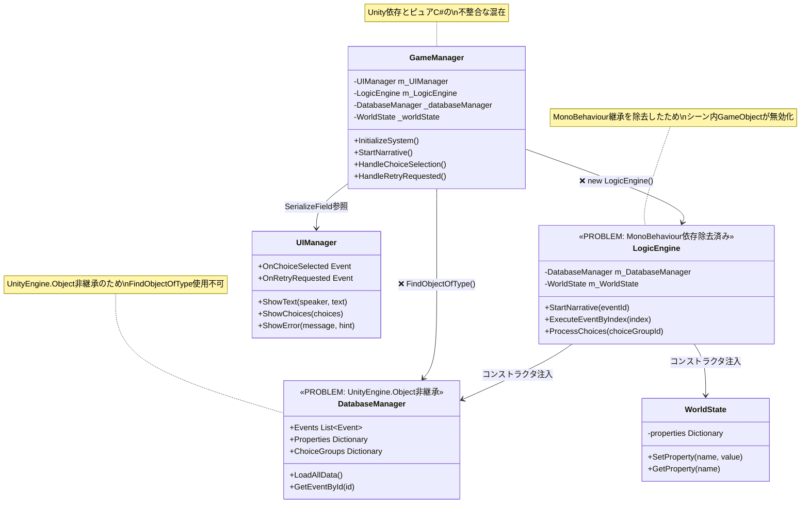
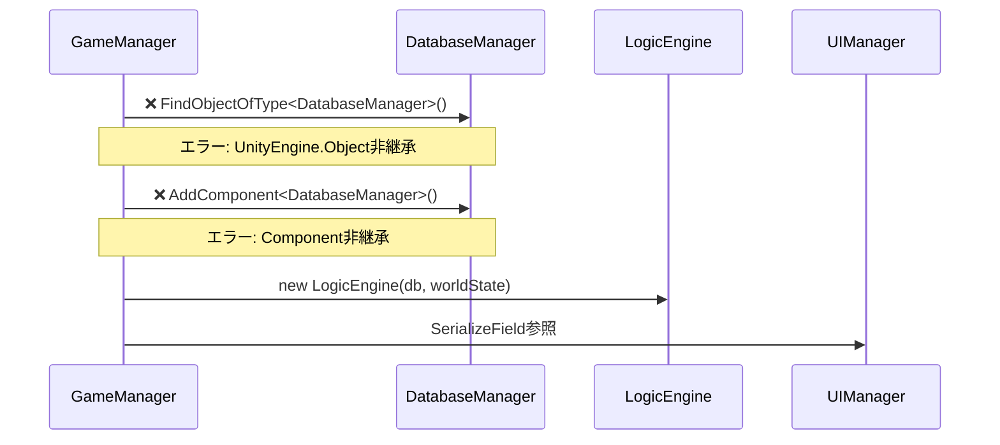

# 現在のアーキテクチャ問題 - UML図

## 現在の問題あるアーキテクチャ

## 主要な問題点

### 1. アーキテクチャ不整合
- **LogicEngine**: MonoBehaviour依存除去済み（テスト可能）
- **DatabaseManager**: Unity依存除去済み（テスト可能）  
- **GameManager**: Unity依存のまま（テスト不可）

### 2. 初期化フローの破綻

### 3. シーン整合性の問題
- 既存シーン内のLogicEngine GameObjectが無効化
- MonoBehaviour → ピュアC#変更による参照切れ
- Inspector設定との不整合

## 技術的負債の蓄積

### A. 設計思想の混在
- **旧**: イベント駆動アプローチ
- **新**: Entity-Property システム（memo.txt）
- **現在**: 中途半端なリファクタリング状態

### B. 依存関係の混乱
- Unity依存コンポーネントとピュアC#クラスの混在
- テスト可能な部分と不可能な部分の分離不完全
- 初期化順序の複雑化

### C. 保守性の悪化
- 複数のアーキテクチャパターンの同居
- 責務分離の不明確化
- デバッグ困難性の増大
