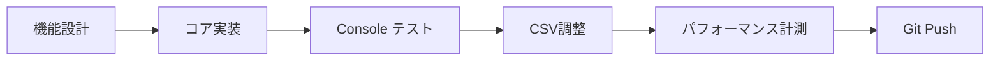
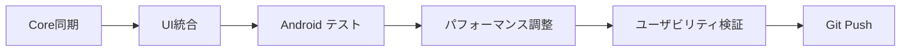

# NarrativeGen 開発戦略仕様書

## 📋 概要

本ドキュメントでは、NarrativeGenプロジェクトにおけるWeb環境（Cursor Web）とデスクトップ環境（Unity）を活用した最適な開発戦略を定義します。

## 🎯 開発環境の役割分担

### Web環境（Cursor Web）: Core Logic Development Center

**主要責任**:
- ナラティブエンジンのコアロジック開発
- アルゴリズムの実装・テスト・最適化
- CSVデータ設計と管理
- 高速プロトタイピング

**開発対象**:
```
NarrativeGen.Core/
├── Models/Entity.cs          # エンティティシステム
├── Engine/RecursiveResolver.cs  # 再帰処理エンジン
├── Engine/CommandProcessor.cs   # コマンド処理
├── Data/DataManager.cs       # データ管理
└── NarrativeEngine.cs       # メインエンジン

NarrativeGen.Console/
└── Program.cs               # テスト・検証環境
```

**開発フロー**:


### Unity環境: User Experience & Platform Integration

**主要責任**:
- UI/UX設計・実装
- Android最適化
- プラットフォーム統合
- ユーザビリティテスト

**開発対象**:
```
Assets/Scripts/
├── Core/GameManager.cs       # Unity統合管理
├── Logic/SyntaxEngine.cs     # Coreライブラリ連携
├── UI/UIManager.cs          # UI制御
├── Data/DatabaseManager.cs  # Unity側データ管理
└── Parsing/                 # Unity固有パーサー
```

**開発フロー**:


## 🔄 開発ワークフロー

### フェーズ1: 機能開発サイクル

#### Web環境での開発手順（推奨時間配分: 60%）

```bash
# 1. 新機能ブランチ作成
git checkout -b feature/[機能名]

# 2. コアロジック開発
# - RecursiveResolver.cs の拡張
# - CommandProcessor.cs の機能追加
# - Entity.cs の改良

# 3. 即時テスト・検証
dotnet run
> start
> process "[テストテキスト]"
> test entity [エンティティ名]
> stats

# 4. CSVデータ設計・調整
# - Variables.csv
# - RecursiveDictionary.csv
# - SyntaxCommands.csv

# 5. パフォーマンス最適化
# - メモリ使用量監視
# - 処理速度計測
# - エラーハンドリング強化

# 6. コミット・プッシュ
git add .
git commit -m "feat: [機能の説明]"
git push origin feature/[機能名]
```

#### Unity環境での統合手順（推奨時間配分: 40%）

```bash
# 1. 最新版同期
git pull origin master
git merge feature/[機能名]

# 2. Unity統合テスト
# - SyntaxEngine動作確認
# - UIManager表示テスト
# - GameManager連携確認

# 3. Android実機テスト
# - メモリ使用量確認
# - CPU負荷測定
# - Touch UI 動作確認
# - フレームレート計測

# 4. パフォーマンス最適化
# - TextMeshPro設定調整
# - UI描画最適化
# - Android固有問題解決

# 5. 統合コミット
git add Assets/Scripts/
git commit -m "unity: [機能名]のUI統合とAndroid最適化"
git push origin master
```

### フェーズ2: 開発サイクル管理

#### 短期サイクル（1-2日間）
```
Day 1: Web環境
- コアロジック開発
- アルゴリズム実装
- Console テスト
- Git コミット

Day 2: Unity環境  
- Core同期
- UI統合
- Android テスト
- 最適化・調整
- Git コミット
```

#### 中期サイクル（1週間）
```
月火水: Web環境集中期間
- 新機能コア開発
- データ構造設計
- アルゴリズム最適化

木金: Unity環境集中期間
- UI統合作業
- Android最適化
- ユーザビリティ改善

土日: 統合・検証期間
- 全体動作テスト
- ドキュメント更新
- 次週計画策定
```

#### 長期サイクル（1ヶ月）
```
Week 1-2: 機能開発フェーズ（Web重点）
- 新機能アーキテクチャ設計
- コアロジック実装
- 基本動作検証

Week 3: 統合・最適化フェーズ（Unity重点）
- Unity統合作業
- パフォーマンス最適化
- Android特化調整

Week 4: 品質向上フェーズ（両環境）
- 全体テスト実施
- バグ修正・改善
- ドキュメント整備
- リファクタリング
```

## 🛠️ 開発ツール・効率化

### Git管理戦略

#### ブランチ戦略
```
main           # 本番リリース版
develop        # 開発統合版  
feature/*      # 機能開発（Web環境）
unity/*        # Unity固有作業
hotfix/*       # 緊急修正
release/*      # リリース準備
```

#### コミットメッセージ規約
```
feat:     新機能追加
fix:      バグ修正
docs:     ドキュメント更新
style:    コードスタイル修正
refactor: リファクタリング
test:     テスト追加・修正
chore:    ビルド・設定変更
unity:    Unity固有の変更
web:      Web環境固有の変更
```

### 開発効率化スクリプト

#### Web環境用エイリアス
```bash
# ~/.bashrc or ~/.zshrc
alias nar="dotnet run"
alias nartest="dotnet run && echo 'start' && echo 'test entity cheeseburger'"
alias narbuild="dotnet clean && dotnet build"
alias narstats="dotnet run && echo 'stats'"
```

#### 自動化スクリプト例
```bash
# scripts/sync-to-unity.sh
#!/bin/bash
echo "Web開発完了 - Unity環境への同期開始"
git add .
git commit -m "web: 開発フェーズ完了"
git push origin develop
echo "同期完了 - Unity環境での作業準備完了"
```

## 📊 成功指標・KPI

### Web環境での目標指標
- ✅ **開発速度**: 新機能プロトタイプ 1-2日以内
- ✅ **テスト品質**: Console テスト 100%パス率
- ✅ **パフォーマンス**: 処理時間 < 100ms
- ✅ **コード品質**: 循環複雑度 < 10

### Unity環境での目標指標  
- ✅ **ユーザビリティ**: タッチ応答 < 50ms
- ✅ **メモリ効率**: 使用量 < 500MB
- ✅ **バッテリー効率**: 消費率 < 10%/hour
- ✅ **安定性**: クラッシュ率 < 0.1%

### 統合目標指標
- ✅ **同期効率**: Web→Unity統合 < 1日
- ✅ **リリース頻度**: 週次デプロイ可能
- ✅ **機能完成度**: 設計→リリース < 2週間
- ✅ **品質維持**: 回帰テスト 100%パス

## 🔮 将来展開計画

### Phase 1: 基盤強化（現在-3ヶ月）
- Core エンジンの安定化
- Unity統合の完全自動化
- Android最適化の完了

### Phase 2: 機能拡張（3-6ヶ月）  
- AI統合（GPT API連携）
- クラウド同期システム
- 高度なナラティブ機能

### Phase 3: プラットフォーム展開（6-12ヶ月）
- iOS対応
- Web版リリース
- Steam展開検討

## 📝 注意事項・ベストプラクティス

### 開発時の注意点
1. **環境分離**: Web環境とUnity環境の責任を明確に分離
2. **同期頻度**: 最低日次でGit同期を実施
3. **テスト**: 各環境で独立したテストを実施
4. **ドキュメント**: 変更時は必ずドキュメント更新

### パフォーマンス考慮事項
1. **メモリ管理**: 大量データ処理時のメモリリーク注意
2. **処理時間**: 再帰処理の深度制限実装
3. **Android制約**: バッテリー・メモリ制約への配慮
4. **データサイズ**: CSV ファイルサイズの適切な管理

---

**更新履歴**:
- 2024/07/13: 初版作成 - Web/Unity開発戦略策定 