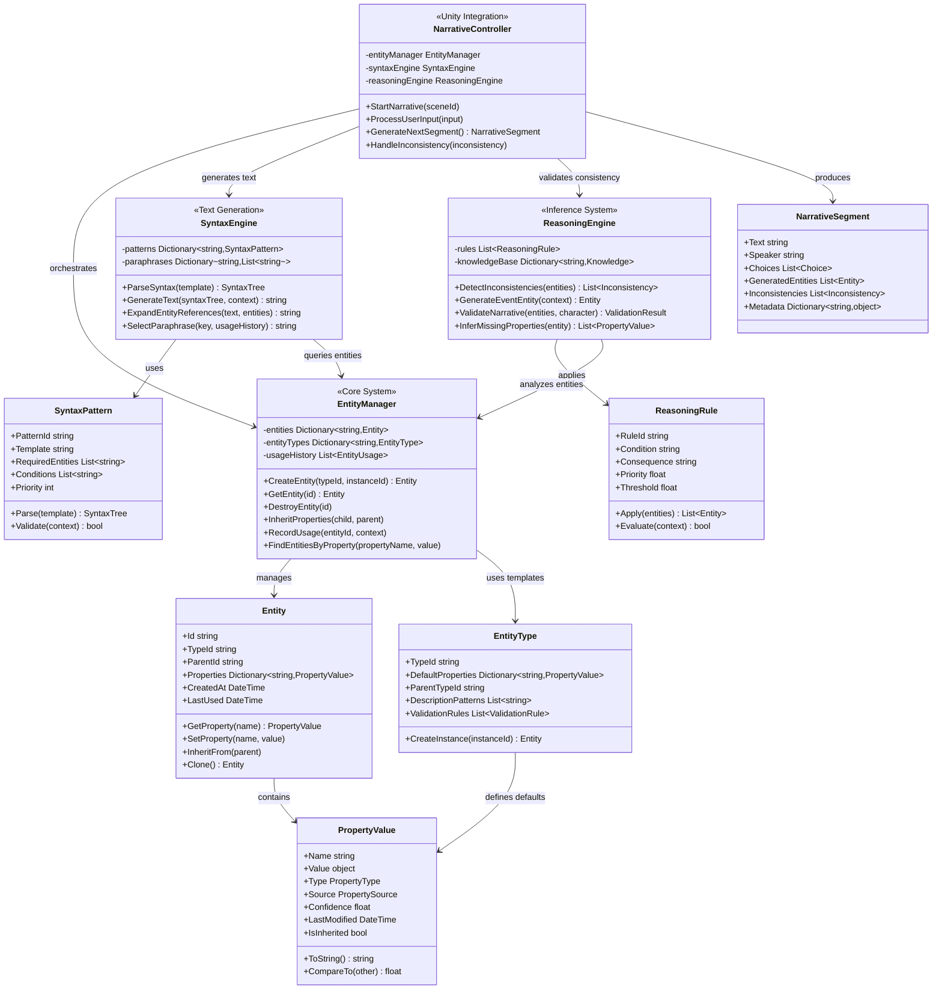
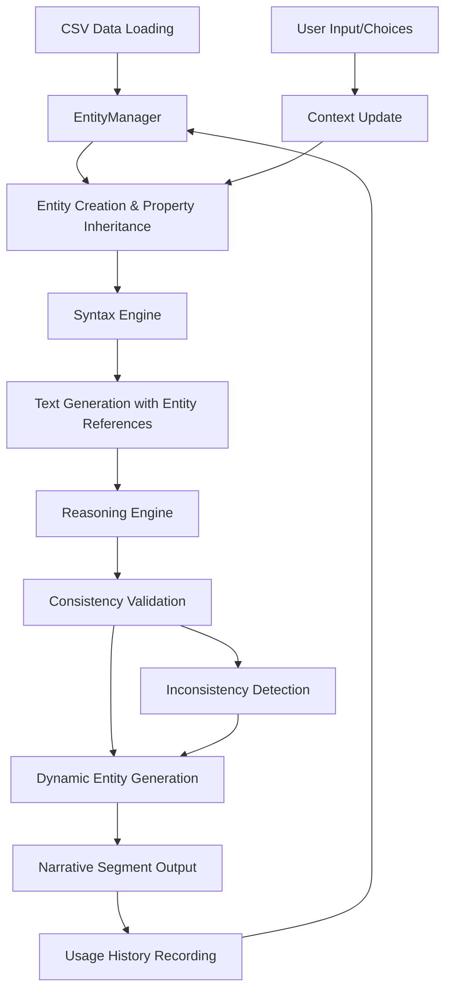
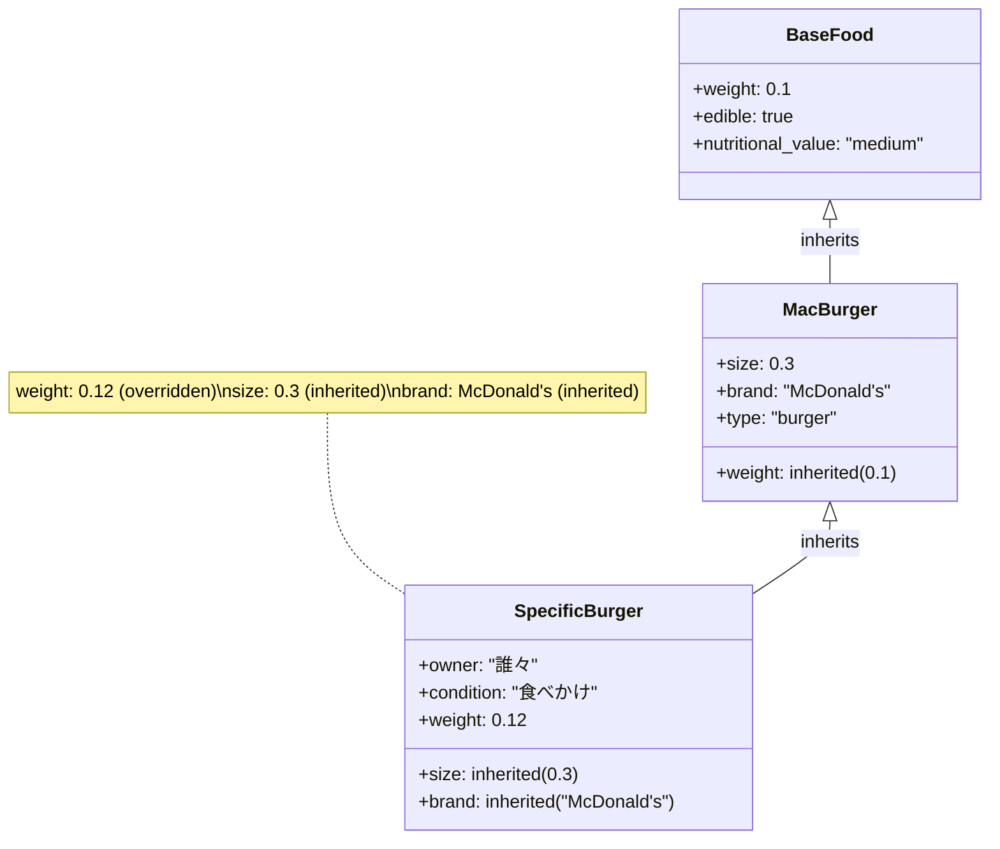
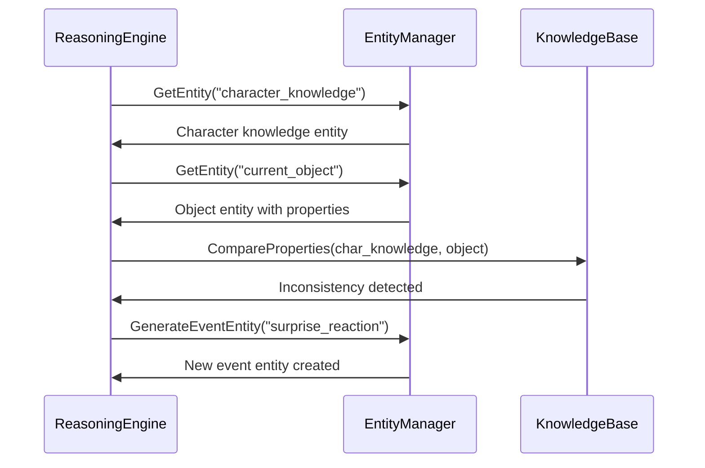

# 理想的なEntity-Propertyアーキテクチャ設計

## memo.txtベースの新アーキテクチャ



## データフロー図



## 階層的プロパティ継承システム



## 構文パターン処理例

```
入力: {scene description:[あなたは[LOCATION]に立っている。], {目の前には[OBJECT]がある。}}

処理フロー:
1. SyntaxEngine.ParseSyntax() → SyntaxTree生成
2. EntityManager.GetEntity("LOCATION") → Entity取得
3. EntityManager.GetEntity("OBJECT") → Entity取得
4. SyntaxEngine.ExpandEntityReferences() → 実体参照展開
5. SyntaxEngine.SelectParaphrase() → 使用履歴考慮の言い換え選択

出力: "あなたは古い図書館に立っている。目の前には埃をかぶった本がある。"
```

## 推論エンジンの動作例



## 主要な設計原則

### 1. 単一責任原則
- **EntityManager**: Entity生命周期管理
- **SyntaxEngine**: テキスト生成
- **ReasoningEngine**: 一貫性推論

### 2. 依存性逆転
- 全コンポーネントがインターフェース経由で通信
- Unity依存を最上位層に限定
- テスト可能な設計

### 3. 拡張性
- プラグイン可能な推論ルール
- 動的な構文パターン追加
- モジュラーなEntity型定義
