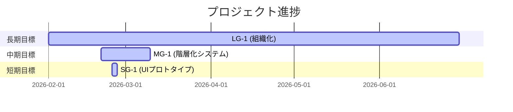

# Milestone Plan

## 基本情報

- **最終更新**: 2026-02-24T13:55:00+09:00
- **更新者**: Orchestrator

---

## 長期目標（Someday / 月次〜四半期）

### LG-1: 大規模プロジェクト対応：組織化・階層化システムの完成

- **ゴール**: 数百〜数千ノードを扱う大規模シナリオを、ディレクトリ構造で破綻なく管理・編集できるシステムの提供。
- **期限目安**: 2026-06
- **状態**: 進行中
- **進捗**: 20%
- **関連マイルストーン**: MG-1 (Node Hierarchy)

---

## 中期目標（Later / 1〜2週間）

### MG-1: ノード階層システム（Node Hierarchy System）の実装

- **ゴール**: CSV/JSON のデータ層から UI 編集層まで、階層型ノード管理をエンドツーエンドでサポートする。
- **期限目安**: 2026-03-10
- **状態**: 進行中
- **進捗**: 50%
- **含まれるタスク**: TASK_102 (Done), TASK_103, TASK_104
- **完了基準**:
  - [x] CSV での `node_group` 対応と Canonical ID の解決（Phase 2）
  - [ ] Web Tester UI での階層表示・フィルタリング（Phase 3）
  - [ ] 既存フラットモデルからの移行ツールの提供（Phase 4）
  - [x] テスト全通過・ビルド成功

---

## 短期目標（Next / 今日〜数日）

### SG-1: ノード階層 UI のプロトタイプ（Phase 3）

- **ゴール**: Web Tester の「ノード一覧」をフォルダツリー形式またはグループ化表示にし、階層構造を視覚化する。
- **対象タスク**: TASK_103
- **完了基準**:
  - [ ] グループごとのアコーディオン表示またはツリー表示の導入
  - [ ] 完全IDを使用したジャンプ機能の維持

---

## 現在地マップ

---

## 履歴

- 2026-02-24 13:55: MILESTONE_PLAN.md を初期化
