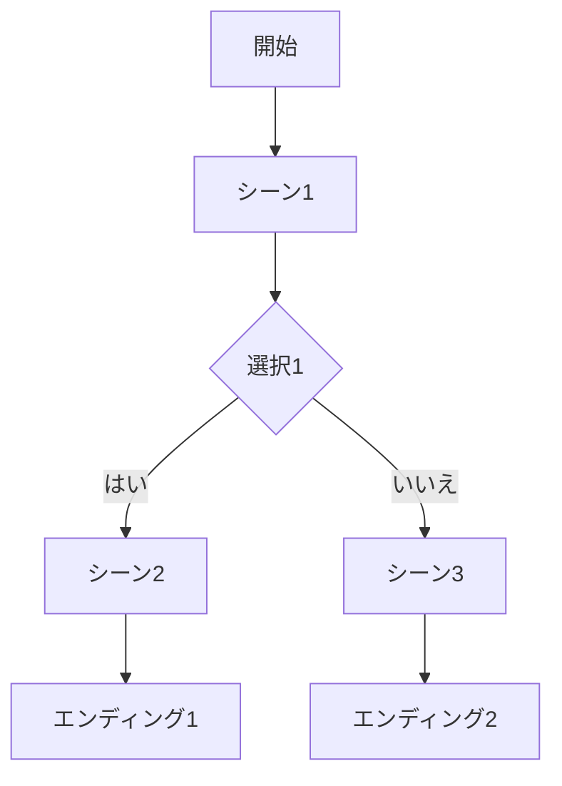

# Mermaidプレビュー機能仕様

## 概要
Mermaidプレビューは、Web Testerの右側ペインに表示される読み取り専用プレビュー機能で、現在のストーリーモデルのシーン遷移をMermaidダイアグラム形式で可視化します。

- シーン遷移の **全体構造把握用ビュー**
- 右ペインの **幅リサイズ**・**ズーム**・**パン** に対応（2025-12-08 時点）

## 機能範囲
- シーン遷移のみ表示（条件、フラグ、リソース等の詳細は除外）
- 読み取り専用（将来的にインタラクティブ編集予定）
- ズーム / パン / ペイン幅リサイズにより大規模グラフも閲覧可能

## 表示場所
- 既存タブの右側ペイン
- タブ切り替えで表示/非表示を切り替え可能

## 技術仕様

### Mermaidダイアグラム形式

### 実装アプローチ
1. モデルデータからMermaid構文を生成
2. Mermaidライブラリを使用してレンダリング
3. 右側ペインに埋め込み表示

## ユースケース
- ストーリーの全体構造を把握
- 遷移フローの確認
- デバッグ支援

## 制約事項
- 条件分岐の詳細は表示せず、単純な遷移のみ
- パフォーマンスを考慮し、ノード数が多くなった場合の最適化が必要

## 現在のUI挙動（2025-12-08 時点）

### レイアウト
- 右ペインは `clamp(320px, 32%, 520px)` を基準としたレスポンシブ幅
- `Story` 本文との境界にドラッグハンドル（`col-resize`）を表示
- ハンドルをドラッグして右ペイン幅を任意に調整可能

### 操作系
- `M` キー: Mermaid プレビューの表示 / 非表示トグル
- 右ペインヘッダー
  - `-` ボタン: ズームアウト（20% 刻み）
  - `+` ボタン: ズームイン（20% 刻み）
  - `1x` ボタン: ズームリセット（100%）
  - ラベル: 現在のズーム倍率（%）
- メインキャンバス
  - **マウスホイール上下**: ズームイン / アウト
  - **中クリックドラッグ** または **Shift+左ドラッグ**: キャンバスのパン（移動）
  - スクロールバー: 追加のスクロール移動

### 制約
- ノードやエッジは読み取り専用（クリックでの編集遷移は未実装）
- 条件・フラグ等の詳細はダイアグラム上には表示しない

## 将来拡張
- インタラクティブ編集（ノードクリックで編集モードへ）
- 条件表示のオプション追加