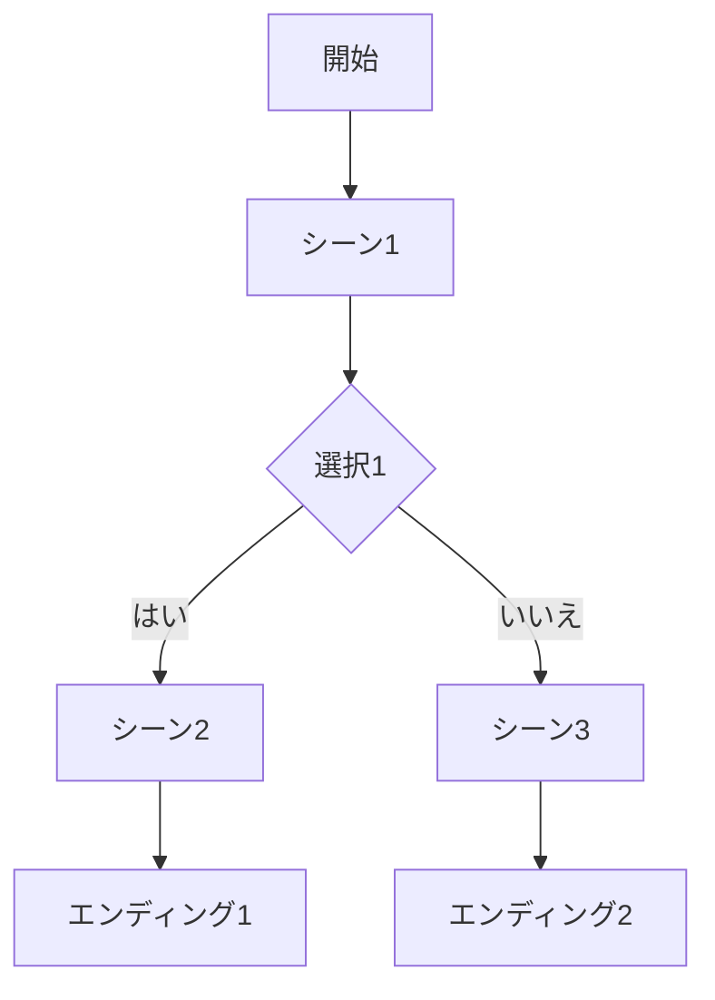

# Mermaidプレビュー機能仕様

## 概要
Mermaidプレビューは、Web Testerの右側ペインに表示される読み取り専用プレビュー機能で、現在のストーリーモデルのシーン遷移をMermaidダイアグラム形式で可視化します。

## 機能範囲
- シーン遷移のみ表示（条件、フラグ、リソース等の詳細は除外）
- 初期実装は読み取り専用（将来的にインタラクティブ編集予定）

## 表示場所
- 既存タブの右側ペイン
- タブ切り替えで表示/非表示を切り替え可能

## 技術仕様

### Mermaidダイアグラム形式

### 実装アプローチ
1. モデルデータからMermaid構文を生成
2. Mermaidライブラリを使用してレンダリング
3. 右側ペインに埋め込み表示

## ユースケース
- ストーリーの全体構造を把握
- 遷移フローの確認
- デバッグ支援

## 制約事項
- 条件分岐の詳細は表示せず、単純な遷移のみ
- パフォーマンスを考慮し、ノード数が多くなった場合の最適化が必要

## 将来拡張
- インタラクティブ編集（ノードクリックで編集モードへ）
- 条件表示のオプション追加
- ズーム/パン機能