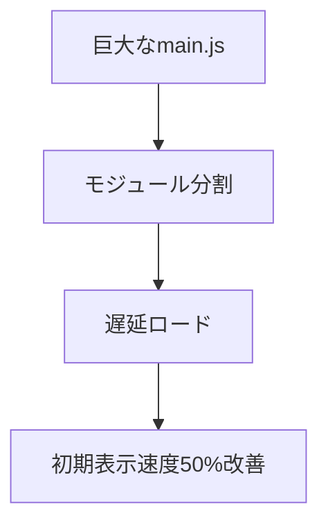
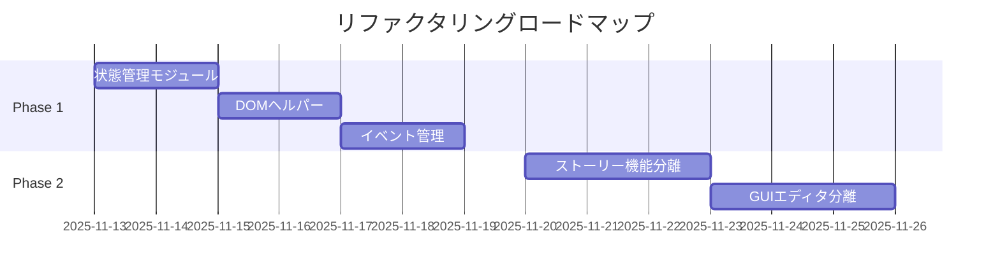

# 申し送り (Handover) - 2025年11月12日

## 完了した作業

### 1. カラーパレットの統合と背景色修正
- ✅ `themeBtn` のパレット連動修正
- ✅ 白い背景の全面的な修正（17箇所）
- ✅ モーダル/パネルの半透明要素のダークテーマ化

### 2. リファクタリング基盤の構築
- ✅ モジュール構造の設計（`config/`, `core/`, `ui/`, `features/`）
- ✅ パレット管理モジュール (`src/config/palettes.js`)
- ✅ テーマ管理モジュール (`src/ui/theme.js`)
- ✅ トースト通知モジュール (`src/ui/toast.js`)

### 3. エラー修正
- ✅ `guiEditBtn is not defined` エラーの解消
- ✅ JSONロード機能の回復

## 未作業分

### 1. リファクタリング Phase 1
- ⬜ `src/core/state.js` の実装（状態管理）
- ⬜ `src/ui/dom.js` の実装（DOM操作ヘルパー）
- ⬜ `src/ui/events.js` の実装（イベント管理）
- ⬜ `main.js` のモジュール置換

### 2. テストケース
- ⬜ カラーパレット変更の包括的テスト
- ⬜ トースト通知の動作検証

## 理解して未反映分

### 1. パフォーマンス最適化


### 2. コンポーネントアーキテクチャ
- 状態管理ライブラリの導入検討（Redux vs MobX）
- コンポーネント境界の再定義

## 次の推奨アクション

### 即時対応
1. 基盤モジュールの実装完了
2. `main.js` のリファクタリング開始

### 短期計画


## 緊急対応事項
- なし

## ブランチ状態
```
git log --oneline -n 3
4fd6bea fix: 白い背景のハードコード修正
3765c1f fix: 半透明要素のダークテーマ化
fc65cfd feat: リファクタリング基盤構築
```

## テスト環境
- http://localhost:5173
- テストガイド: `docs/PHASE1_TEST_GUIDE.md`

## 担当者
- AIエージェント: Cascade
- 最終更新: 2025-11-12 19:45 JST
