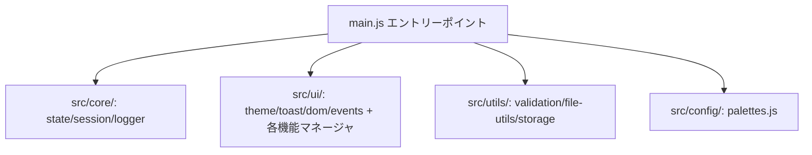

# 申し送り (Handover) - 2025年11月17日

## 完了した作業

### 1. リモート変更取得とローカル同期確認
- ✅ `git fetch origin` でリモート最新取得。
- ✅ `git pull --ff-only origin master` でローカル master をリモートと同期（24コミット分 fast-forward）。
- ✅ 現在: ブランチ `master` は `origin/master` と完全に同期。ワーキングツリークリーン。

### 2. 現状プロジェクト状態の把握
- ✅ コア構成確認:
  - `packages/engine-ts/`: TypeScript エンジン（`NodeDef { id, text?, choices? }` の v1.0 構造）。
  - `apps/web-tester/`: main.js がエントリーポイント、主要ロジックはモジュール化済み（src/core/, src/ui/, src/utils/）。
- ✅ Web Tester 機能確認（Phase 1 実装済み）:
  - SVGアイコンシステム（Lucide Icons, CSS変数制御）。
  - カラーパレット機能（ThemeManager + palettes.js, localStorage 保存）。
  - クイックノード作成（ボタン/Nキー、テンプレート選択）。
  - 選択肢一括編集（共通条件・効果適用）。
  - アドバンスドタブ（AI設定, キーバインド, デザイナー辞書エディタ）。
  - LexiconManager（ローカル辞書管理、JSONインポート/エクスポート）。

### 3. ドキュメントと実装の整合性チェック・修正
- ✅ `docs/WEB_TESTER_REFACTORING.md`: Phase 1 チェックリストを現状に合わせて更新（実装済みモジュールを [x] に）。
- ✅ `docs/reference.md`: 冒頭に「現状メモ」を追加し、v1.1 仕様が提案段階であることを明記（エンジン未実装）。

## 未作業分

### 1. リファクタリング Phase 1 残り
- ⬜ `src/config/constants.js` 作成（定数分離）。
- ⬜ `src/config/keybindings.js` 作成（キーバインド設定分離）。

### 2. Phase 2-3 機能実装
- ⬜ Mermaid風グラフエディタ（Dagre + D3.js 拡張、自動レイアウト）。
- ⬜ 検索・フィルタ機能（ノード検索、到達不能ノードハイライト）。
- ⬜ モデル検証ツール（参照エラー/ループ検出）。
- ⬜ スニペット・コピー＆ペースト・テンプレート拡張。
- ⬜ リアルタイムプレビュー・マルチエンディング可視化。

### 3. モデル仕様 v1.1 導入
- ⬜ `NodeDef` に `nodeType`, `next`, `onEnter` 追加。
- ⬜ `playthrough.schema.json` 更新。
- ⬜ Web Tester GUI の JSON マッピング更新。
- ⬜ 既存モデル互換性確保。

## 理解して未反映分

### 1. Web Tester モジュール化進捗


- Phase 1 基盤モジュールは実装完了。機能モジュール（story/graph/debug/gui-editor 等）も存在。
- 言い換え辞書 UI と LexiconManager は実装済み、ローカル保存・JSON操作可能。

### 2. ドキュメント整理
- `docs/` の各ファイル（NEXT_PHASE_PROPOSAL.md, DESIGN_IMPROVEMENTS_SPEC.md 等）は提案段階の仕様を記載。
- 実装済み機能との大きな齟齬なし。v1.1 仕様は明確に「提案」として扱う。

## 次の推奨アクション

### 即時対応
1. config 分離完了（constants.js, keybindings.js）。
2. Phase 1 機能の動作確認（PHASE1_TEST_GUIDE.md に沿ったテスト）。

### 短期（今週中）
1. Phase 2: Mermaid風グラフエディタ実装開始（基盤構築）。
2. 検索・フィルタ機能の実装。

### 中期（今月中）
1. モデル検証ツールの追加。
2. スニペット・テンプレート機能の拡張。

### 長期（来月以降）
1. モデル spec v1.1 の実装と移行。
2. パフォーマンス最適化・アクセシビリティ改善。

## 緊急対応事項
- なし

## ブランチ状態
```bash
git log --oneline -n 3
9d14af5 fix: Remove remaining legacy reference functions and fix lint errors
4cc2424 feat: Implement LexiconManager module for lexicon management
016726b feat: Implement AiManager module for AI integration features
```

## テスト環境

- http://localhost:5173
- テストガイド: `docs/PHASE1_TEST_GUIDE.md`

## 追加作業セッション (2025-11-18)

### 完了した作業

- ✅ **Session 参照完全移行完了**
  - `main.js` 内のすべてのグローバル `session`/`currentModelName` 参照を `session.js` API に移行
  - 修正対象関数: `appendStoryFromCurrentNode`, `showVariableEditor`, `downloadTopBtn`, `autoSave`, `loadAutoSave`, `saveToSlot`, `loadFromSlot`, `renderSaveSlots`, `checkForDraftModel`, `saveDraftModel`, `saveGuiBtn`
  - `session is not defined` ランタイムエラーが完全に解消
- ✅ **ブラウザ動作確認完了**
  - Vite開発サーバーで動作テスト実施
  - `session is not defined` エラーが発生しなくなったことを確認
  - Referenceタブが正常に切り替わることを確認
- ✅ **OpenSpec-WebTester.md 更新**
  - ノードIDリネーム機能を「実装済み（テスト必要）」から「実装済み」に更新

### 進行中の作業

- ⏳ **ノードIDリネーム機能手動テスト**
  - GUIエディターでのノードID変更機能をテスト中
  - 参照更新（startNode, choices.target, metadata.nodeOrder）の正確性を検証
  - テストケース: 通常ノード変更, startNode変更, 複数参照更新

### 未完了のタスク

1. **ノードIDリネーム機能テスト完了**: GUIエディタでのID変更テスト
2. **OpenSpec最終更新**: テスト結果を反映したドキュメント更新
3. **gitコミット・プッシュ**: すべての変更をリモートmainに反映

### 懸念点

- ノードIDリネーム機能のテストが未完了のため、実装の正確性が未確認
- GUIエディターのバッチ編集機能やAI機能との統合確認が必要

## 最終更新: 2025-11-18 18:45 JST
