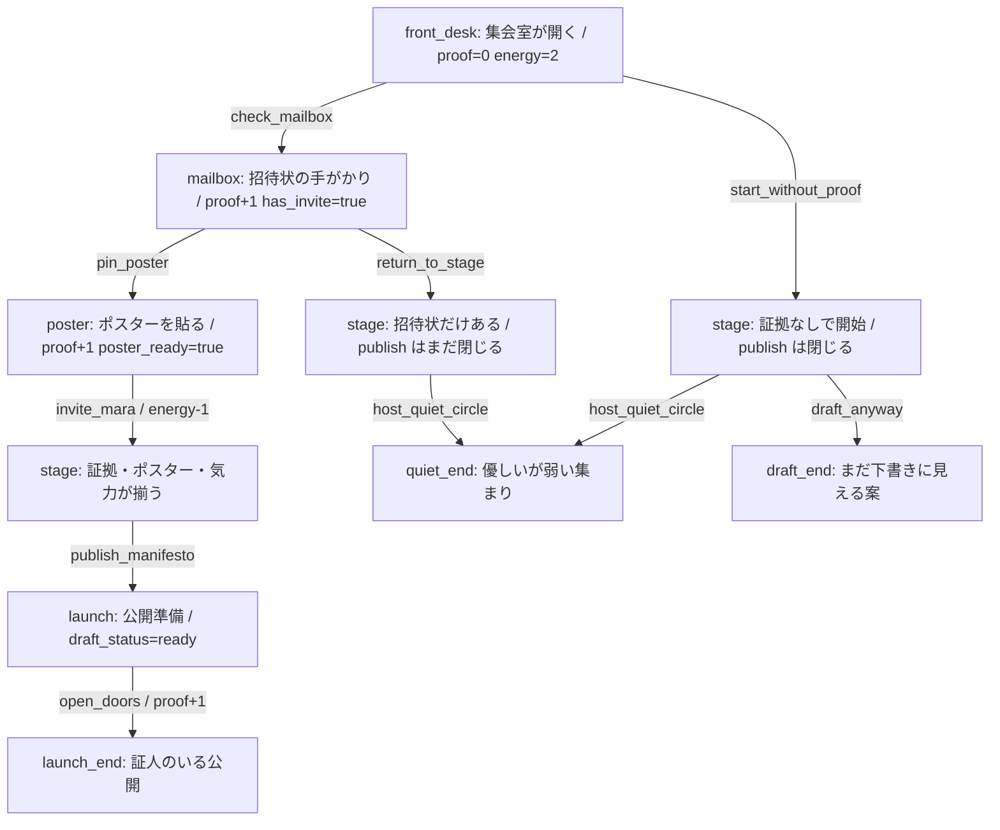
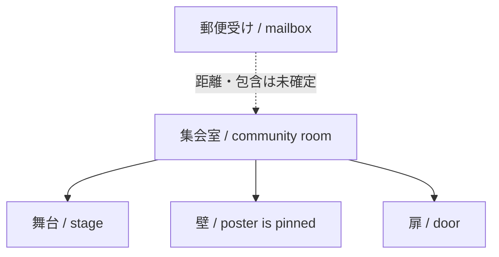

# Authoring Sample Japanese Human Review Brief

この文書が authoring sample の primary human review surface です。分岐マップ、登場要素レジストリ、状態変数レジストリ、場所 / 空間関係、bounded review guide を含みます。詳細な route trace が必要な場合だけ `docs/samples/authoring-sample-readback.md` を開いてください。

この文書は `models/spreadsheets/authoring-sample.csv` を人間が確認するための日本語レビュー面です。英語の readback と route trace を読む前に、物語として何が起きているか、何を見ればよいかを掴むための橋渡しとして使います。これは本番用の日本語訳でも、最終的な物語承認でもありません。

## 物語の概要

マーラは、地域修繕の計画を集会室で人々に信じてもらおうとしている人物です。集会が始まるまでの短い時間に、プレイヤーは招待状の手がかりを探すか、ポスターを貼るか、証拠が足りないまま会を始めるかを選びます。中心になる圧力は、計画を公開してよいだけの証拠、見える準備、そしてマーラを登壇させる余力が揃っているかです。選択によって、招待状の有無、ポスターの準備、証拠の量、残りの気力、原稿の状態が変わります。結末は、証拠を伴う公開、優しいが弱い集まり、まだ下書きに見える計画の違いを示します。

## 登場物 / 状態変化

- マーラ: 集会室で計画を確かめ、公開するかどうかの場面に立つ中心人物です。モデル上の話者名は `Mara` です。
- 招待状: 郵便受けで見つかる手がかりです。これを見つけると、会を進める理由ができた状態になります (`has_invite`)。
- ポスター: 地域修繕の約束を部屋に見える形で示すものです。貼られると、計画が部屋の中で具体的になります (`poster_ready`)。
- 証拠: 計画を信じてもらうための根拠や公開性です。公開には一定量の証拠が必要です (`proof`)。
- 気力: マーラを登壇させるために残っている行動余力です。公開条件にも関わるため、単なる飾りではありません (`energy`)。
- 原稿の状態: 計画が下書きなのか、ポスターで補強されたのか、公開できる状態なのかを示します (`draft_status`)。

## ルート概要

- Launch proof route: プレイヤーは郵便受けを確認し、ポスターを貼り、マーラを登壇させ、公開に必要な証拠・ポスター準備・気力を揃えます。原稿は `ready` になり、証拠を伴う公開の結末に進みます。
- Quiet circle route: プレイヤーは証拠を集めずに会を始め、静かな輪を作ります。会は成立しますが、公開に必要な条件が足りないため、計画は強く打ち出されません。
- Draft anyway route: プレイヤーは証拠を集めずに下書きを進めます。何かは残りますが、ポスターと証拠が足りないため、まだ輪郭の弱い案として終わります。
- Partial proof return route: プレイヤーは郵便受けで一つ目の証拠を得ますが、ポスターを貼らずに戻ります。部分的な証拠だけでは公開条件が開かないことを示すルートです。

## 分岐マップ

この図は完全な地図ではなく、選択肢と状態変化の見取り図です。`publish_manifesto` は `poster_ready=true`、`proof >= 2`、`energy >= 1` が揃った `stageReady` でだけ開きます。

## 登場要素レジストリ

| 種別 | 要素 | 役割 | 根拠 |
|---|---|---|---|
| 人物 | マーラ (`Mara`) | 計画を公開できるかを確かめる中心人物。stage と ending で話者になる。 | `speaker=Mara`、`stage`、`launch_end`、`quiet_end` |
| 語り | ナレーター (`Narrator`) | 集会室、ポスター、公開準備、下書き結末を描写する。 | `speaker=Narrator` |
| 物 / 手がかり | 招待状・郵便受けのメモ | 最初の証拠を与え、会を進める理由を作る。 | `check_mailbox`、`has_invite=true`、`proof+1` |
| 物 | ポスター | 計画を部屋に見える形にし、公開条件の一部を満たす。 | `pin_poster`、`poster_ready=true`、`proof+1` |
| 概念 | 地域修繕 (`theme`) | この小話で公開しようとしている計画の主題。 | `theme=neighborhood repair` |
| 概念 | 公開計画 / 原稿 | 下書きから公開可能状態へ変わる対象。 | `draft_status=outline/poster pinned/ready` |

## 状態変数レジストリ

| 変数 | 人間向けの意味 | 初期値 | 主な変化 | レビュー観点 |
|---|---|---:|---|---|
| `has_invite` | 招待状の手がかりを持っているか | `false` | `check_mailbox` で `true` | 会を始める理由として読めるか |
| `poster_ready` | ポスターで計画が見える状態か | `false` | `pin_poster` で `true` | 公開条件として納得できるか |
| `proof` | 計画を信じてもらう根拠の量 | `0` | 郵便受け、ポスター、扉を開く選択で増える | 数値が物語上の証拠に見えるか |
| `energy` | マーラを登壇させる余力 | `2` | `invite_mara` で `1` に減る | 消費と公開条件が自然に見えるか |
| `draft_status` | 計画の完成度 | `outline` | `poster pinned`、`ready` へ変わる | 原稿の進み具合として読めるか |

## 場所 / 空間関係

このサンプルは場所を明示する専用 schema を持っていません。そのため、距離や方角を持つ地図は作りません。既存テキストと route trace から根拠づけられる範囲だけを、場所関係として整理します。

| 場所 / 位置 | 上位関係 | 位置づけ | 近接・距離の扱い |
|---|---|---|---|
| 集会室 | 最上位の場面 | 物語が始まり、会が開かれる場所 | 明示あり |
| 舞台 (`stage`) | 集会室内と読むのが自然 | マーラが計画を公開するか判断する場所 | 距離は未指定 |
| 壁 / ポスター | 集会室内の見える面 | ポスターが「最初の証人」として機能する場所 | 距離は未指定 |
| 扉 | 集会室の境界として示唆 | 公開準備と外への開きに関わる場所 | 距離は未指定 |
| 郵便受け (`mailbox`) | 集会室との包含は未確定 | 招待状の手がかりを得る場所 | 集会室との距離・方角は未指定 |

地図を捏造しないため、この artifact では「場所関係図」と「場所関係表」までに留めます。将来のサンプルで地形や階層関係を扱うなら、場所 schema か明示的な本文根拠が必要です。

## この CSV が示していること

- 話者: `Narrator` と `Mara` の話者欄によって、誰の発話・描写かを分けています。
- 複数行の本文: 冒頭ノードは段落を含み、CSV の中で改行を保った文章を扱えることを示しています。
- 初期値: 最初は招待状なし、ポスターなし、証拠 0、気力 2、原稿は `outline` です。
- 効果: 選択によって招待状、ポスター、証拠、気力、原稿状態が変わります。
- 条件付き選択肢: 公開の選択肢は、ポスターが準備済みで、証拠が 2 以上あり、気力が 1 以上あるときだけ選べます。
- 複数結末: 証拠つきの公開、静かな失敗、弱い下書きという異なる終わり方を一つの小さな CSV で示しています。
- export / re-import: 話者、複数行テキスト、表示設定、条件、効果が CSV の書き出しと再読み込み後も残ることを確認する対象です。

## Bounded Review Guide

自由記述で構いません。次の観点だけを見てください。

- 前提は分かるか: マーラが何をしようとしていて、なぜ証拠やポスターが必要なのかが伝わるか。
- 状態変化は意味を持って見えるか: 招待状、ポスター、証拠、気力、原稿状態の変化が物語上の変化として読めるか。
- ルート名と結末は物語の因果に見えるか: テスト用の分岐ではなく、選択の結果として自然に読めるか。
- 文言の粗さか、構造的な分かりにくさか: 単語や表現の荒さだけなのか、何が起きているか自体が掴みにくいのかを分けてください。

## Non-Goals

- 本番用の日本語ローカライズではありません。
- 最終的な物語 canon ではありません。
- 文章の全面的な品質承認ではありません。
- Web Tester、CSV schema、engine semantics、AI、Unity、SaveManager、graph UI のレビューではありません。
- この文書は、authoring sample がレビュー可能な fixture になっているかを判断するための橋渡しです。

## Review-Pack Pattern Note

今回の不足は authoring sample 固有でもありますが、今後の story sample review surface でも再発しやすい構造的な不足です。新しいサンプルを人間レビューに出す前には、少なくとも次の要素を揃えると、route trace の逆変換になりにくくなります。

- primary review surface
- detailed trace
- machine trace
- audit note
- story brief
- route overview
- entity / item registry
- state-variable registry
- place / relation registry
- optional visual branch map

## Source Artifacts

- `docs/samples/authoring-sample-readback.md`
- `docs/samples/authoring-sample-route-trace.json`
- `docs/samples/authoring-sample-logic-audit.md`
- `models/spreadsheets/authoring-sample.csv`
