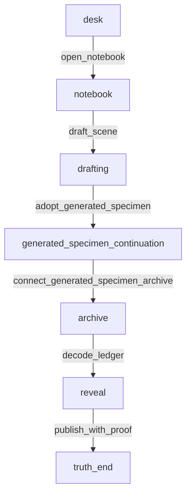

# Generated Specimen Japanese Human Review Brief

この文書が generated specimen の primary human review surface です。生成された最小ストーリー成果物を、人間が「何が生成され、どこが弱いか」を確認できる形で読むための面です。詳細な route trace が必要な場合だけ `docs/samples/generated-specimen-readback.md` を開いてください。

## Story Brief

元モデルは `vertical-slice.json` の短い調査物語です。プレイヤーは古いノートを開き、未完成の場面を下書きし、builder が current node / route / state / story pressure を含む story packet を deterministic SP-DTYARN bridge adapter に渡します。adapter はその packet を反映した structured continuation proposal を返し、生成されたノードは時計塔の鐘という手がかりを archive の ledger path に接続して、既存の proof ending まで到達可能にします。

## 生成された specimen

- Active artifact: `docs/samples/generated-specimen-model.json`
- Generated node: `generated_specimen_continuation`
- Adapter path: `DeterministicSpdtyarnBridgeAdapter.generateContinuationProposal` from `packages/engine-ts/src/spdtyarn-bridge-adapter.ts`
- Mock provider path remains separate and is not used for this specimen.
- Source route: `open_notebook -> draft_scene`
- Review route: `open_notebook -> draft_scene -> adopt_generated_specimen -> connect_generated_specimen_archive -> decode_ledger -> publish_with_proof`

Story packet summary:

- current node: `drafting`
- route so far: `open_notebook` -> `draft_scene`
- visible choices: `use_mock_ai`, `cut_short`
- gated choices: none
- resources: {   "evidence": 1,   "focus": 1 }
- story pressure: Turn the drafted scene into a proof-bearing clue that can reconnect to the archive route.
- non-goals: Do not claim real AI quality from deterministic adapter output. / Do not redesign schema, CSV, Web Tester UI, or engine transition semantics.

Generated text:

> Deterministic SP-DTYARN bridge: the clocktower bell is extended from drafting after open_notebook -> draft_scene. The adapter reads the current scene "The scene is still thin.", evidence=1, focus=1, and pressure "Turn the drafted scene into a proof-bearing clue that can reconnect to the archive route". It proposes a proof-bearing clue that returns to archive; this is rule-based adapter output, not AI prose quality.

Structured proposal:

- nodeIdHint: `generated_specimen_continuation`
- followUpChoice: `connect_generated_specimen_archive` / "Route the clocktower bell through the archive proof check" -> `archive`
- effect: add resource evidence +2

## Route Overview / Structure Summary



この構造は、生成ノードが単独の文章で終わらず、既存の playable route に戻れることを示します。`drafting` から生成ノードへ入り、生成された clue が `archive` の証拠ルートに接続されます。

## 主要登場要素 / 状態変化

- 主体: 未完成の調査記事を書くプレイヤーと、手がかりを持つ Mira。
- 生成された要素: archive stairs の lantern と、時計塔の鐘を反復する handwriting。
- 接続先: `archive` と ledger decode route。
- `ai_draft_adopted`: generated specimen を採用した時点で `true` になります。
- `draft_status`: `generated specimen adopted` に変わり、下書きが生成ノードとして graph に入ったことを示します。
- `evidence`: generated clue を archive に接続すると `+2` され、既存の proof gate を通れる状態になります。

## Adapter / Builder Boundary

- adapter_generated: generated node id hint、node text、follow-up choice id hint、choice text、target id、effect。
- builder_added: `drafting` から generated node へ入る source adoption choice と artifact/readback scaffolding。
- validation_adjusted: 今回は proposal が既存 specimen IDs と schema-valid effect を返すため、追加補正なし。
- story_packet: current node、route history、visible/gated choices、state snapshot、story pressure、constraints を builder が adapter に渡しています。
- still_not_real_AI: deterministic rule-based adapter output であり、OpenAI/local LLM/最終品質の証明ではありません。

Boundary readback:

```json
{
  "adapter_generated": {
    "fields": [
      "storyPacket.currentNode.id",
      "storyPacket.currentNode.text",
      "storyPacket.route.nodeIds",
      "storyPacket.route.selectedChoiceIds",
      "storyPacket.visibleChoices",
      "storyPacket.gatedChoices",
      "storyPacket.state.resources.evidence",
      "storyPacket.state.resources.focus",
      "storyPacket.state.variables.lead_name",
      "storyPacket.storyPressure",
      "storyPacket.constraints.preferredReturnTargetId",
      "storyPacket.constraints.nonGoals",
      "nodeIdHint",
      "text",
      "followUpChoice.idHint",
      "followUpChoice.text",
      "followUpChoice.targetId",
      "followUpChoice.effects"
    ],
    "follow_up_choice": {
      "effects": [
        {
          "delta": 2,
          "key": "evidence",
          "type": "addResource"
        }
      ],
      "idHint": "connect_generated_specimen_archive",
      "targetId": "archive",
      "text": "Route the clocktower bell through the archive proof check"
    },
    "node_id_hint": "generated_specimen_continuation",
    "text": "Deterministic SP-DTYARN bridge: the clocktower bell is extended from drafting after open_notebook -> draft_scene. The adapter reads the current scene \"The scene is still thin.\", evidence=1, focus=1, and pressure \"Turn the drafted scene into a proof-bearing clue that can reconnect to the archive route\". It proposes a proof-bearing clue that returns to archive; this is rule-based adapter output, not AI prose quality."
  },
  "builder_added": [
    {
      "field": "source_adoption_choice",
      "value": {
        "effects": [
          {
            "key": "ai_draft_adopted",
            "type": "setFlag",
            "value": true
          },
          {
            "key": "draft_status",
            "type": "setVariable",
            "value": "generated specimen adopted"
          }
        ],
        "id": "adopt_generated_specimen",
        "target": "generated_specimen_continuation",
        "text": "Adopt the generated specimen"
      }
    },
    {
      "field": "artifact_serialization_and_readback",
      "value": [
        "docs/samples/generated-specimen-model.json",
        "docs/samples/generated-specimen-route-trace.json",
        "docs/samples/generated-specimen-readback.md",
        "docs/samples/generated-specimen-review-ja.md"
      ]
    }
  ],
  "still_not_real_AI": {
    "reason": "This is deterministic rule-based adapter output, not OpenAI, local LLM, or final narrative quality evidence.",
    "value": true
  },
  "validation_adjusted": []
}
```

## 生成品質メモ

- pass: 生成例は具体的な node text として存在し、route 上で到達・通過できます。
- pass: builder は current node / route / choices / state / story pressure / constraints を含む story packet を adapter に渡しています。
- pass: deterministic adapter proposal は route、current node、evidence、focus、story pressure を本文または choice wording に反映しています。
- pass: deterministic adapter は本文だけでなく、follow-up choice / target / effect を structured proposal として返しています。
- pass: 生成結果は既存モデルの proof route に接続され、ending まで読めます。
- warn: adapter output はまだ決定的で説明的であり、名作品質や real provider quality の証明ではありません。
- warn: `drafting` から generated node へ入る adoption choice は、まだ specimen builder 側の scaffolding です。
- fix: 次の bounded slice では、real generator provider、より豊かな packet、または SP-DTYARN integration を選べます。
- defer: OpenAI provider、local LLM、Web Tester 大改造、新CSV schema は今回の対象外です。

## Review-Pack Pattern Note

- primary review surface: `docs/samples/generated-specimen-review-ja.md`
- detailed trace: `docs/samples/generated-specimen-readback.md`
- machine trace: `docs/samples/generated-specimen-route-trace.json`
- active generated artifact: `docs/samples/generated-specimen-model.json`
