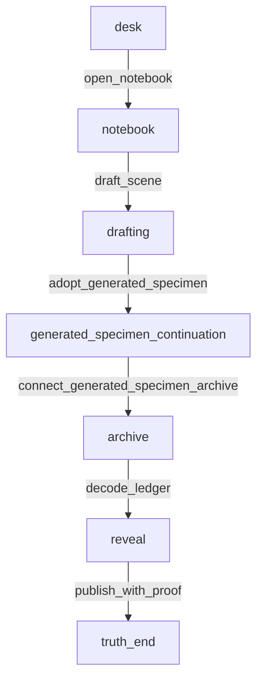

# Generated Specimen Japanese Human Review Brief

この文書が generated specimen の primary human review surface です。生成された最小ストーリー成果物を、人間が「何が生成され、どこが弱いか」を確認できる形で読むための面です。詳細な route trace が必要な場合だけ `docs/samples/generated-specimen-readback.md` を開いてください。

## Story Brief

元モデルは `vertical-slice.json` の短い調査物語です。プレイヤーは古いノートを開き、未完成の場面を下書きし、mock generator が作った continuation を graph に採用します。生成されたノードは、時計塔の鐘という手がかりを archive の ledger path に接続し、既存の proof ending まで到達可能にします。

## 生成された specimen

- Active artifact: `docs/samples/generated-specimen-model.json`
- Generated node: `generated_specimen_continuation`
- Generator path: `MockAIProvider.generateNextNode` from `packages/engine-ts/src/ai-provider.ts`
- Source route: `open_notebook -> draft_scene`
- Review route: `open_notebook -> draft_scene -> adopt_generated_specimen -> connect_generated_specimen_archive -> decode_ledger -> publish_with_proof`

Generated text:

> Mock continuation: the clocktower bell stops being a loose note and becomes a reachable clue. A lantern under the archive stairs repeats the phrase in careful handwriting, giving the player a concrete reason to test the ledger path. It is still marked as mock prose so the generated node can be reviewed before a writer polishes it.

## Route Overview / Structure Summary

この構造は、生成ノードが単独の文章で終わらず、既存の playable route に戻れることを示します。`drafting` から生成ノードへ入り、生成された clue が `archive` の証拠ルートに接続されます。

## 主要登場要素 / 状態変化

- 主体: 未完成の調査記事を書くプレイヤーと、手がかりを持つ Mira。
- 生成された要素: archive stairs の lantern と、時計塔の鐘を反復する handwriting。
- 接続先: `archive` と ledger decode route。
- `ai_draft_adopted`: generated specimen を採用した時点で `true` になります。
- `draft_status`: `generated specimen adopted` に変わり、下書きが生成ノードとして graph に入ったことを示します。
- `evidence`: generated clue を archive に接続すると `+2` され、既存の proof gate を通れる状態になります。

## 生成品質メモ

- pass: 生成例は具体的な node text として存在し、route 上で到達・通過できます。
- pass: 生成結果は既存モデルの proof route に接続され、ending まで読めます。
- warn: mock prose はまだ説明的で、名作品質の本文ではありません。
- warn: node choice/effect は generator ではなく specimen builder が補っています。
- fix: 次の bounded slice では、generator に structured output または story packet を渡し、choice/effect 生成の責務を少しだけ増やす余地があります。
- defer: OpenAI provider、local LLM、Web Tester 大改造、新CSV schema は今回の対象外です。

## Review-Pack Pattern Note

- primary review surface: `docs/samples/generated-specimen-review-ja.md`
- detailed trace: `docs/samples/generated-specimen-readback.md`
- machine trace: `docs/samples/generated-specimen-route-trace.json`
- active generated artifact: `docs/samples/generated-specimen-model.json`
